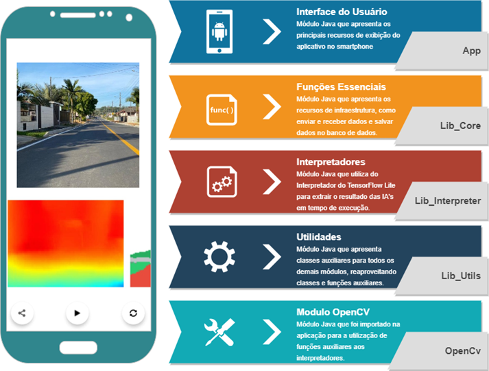
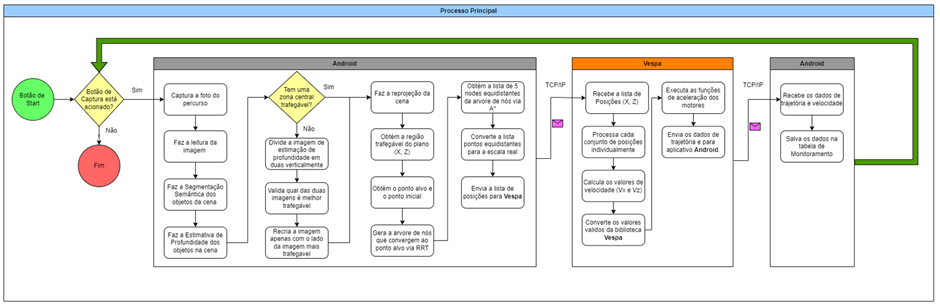

# OwlVision_AppAndroid

## 1. Introdução
O OwlVision é o projeto que foi divido em três repositorios: 

    * OwlVision_AppAndroid : Aplicativo android com função de captura de imagens, interpretação das imagens e geração de trajetórias, desenvolvido majoritariamente em Java.
    * OwlVision_MLVisions: Conjunto de pipelines de processamento de imagens, como por exemplo, pipeline de geração dos modelos de estimação de profundidade e segmentação semantica, também a geração dos parametros intrinsecos da camera e outras pipelines auxiliares.
    * OwlVision_VehicleController: Serviço que recebe os dados de trajetória e faz o controle do veiculo, atráves dos atuardores (motores).
   
## 2. Estrutura do App
   

   
## 3. Fluxograma processo principal
   

## 4. Referências de Projeto
https://www.tensorflow.org/lite/examples/segmentation/overview 
http://robots.stanford.edu/cs223b04/JeanYvesCalib/
https://www.mathworks.com/help/vision/ug/camera-calibration.html
https://msl.cs.illinois.edu/~lavalle/papers/Lav98c.pdf 
